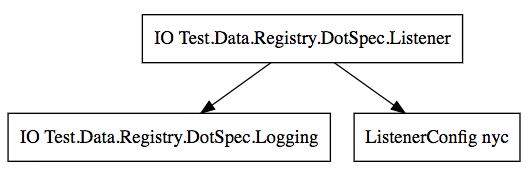

# Dot

A [dot](https://en.wikipedia.org/wiki/DOT_(graph_description_language)) file can be extracted from a registry, showing the dependencies between elements.
You can then display it online with such a [website](http://www.webgraphviz.com/):
<p/>


The graph above was produced with the following code
```haskell

-- create a DOT representation of the graph for "IO Listener"
makeDot @(IO Listener) registry

config =
     valTo @IO (AuthConfig "auth")
  +: valTo @IO (ListenerConfig "nyc")
  +: end

registry =
     fun       newLogging
  +: funTo @IO newAuth
  +: funAs @IO newListener
  +: config

-- A small graph of components

newtype Logging = Logging { info :: Text -> IO () }

newLogging :: IO Logging
newLogging = pure (Logging print)

newtype Auth = Auth { auth :: Text -> IO Bool }
newtype AuthConfig = AuthConfig Text deriving (Eq, Show)

newAuth :: AuthConfig -> Logging -> Auth
newAuth _config _logging = Auth (\t -> print t >> pure True)

newtype Listener = Listener { listen :: Text -> IO () }
newtype ListenerConfig = ListenerConfig Text deriving (Eq, Show)

newListener :: ListenerConfig -> Logging -> IO Listener
newListener _config _logging = pure (Listener print)
```
